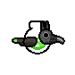

# Nestling

A small pixel platformer about a fledgling learning to fly. Built with Godot 4.



## To do

- [x] Player movement and jump
- [x] Gliding
- [x] Double jump
- [ ] Night mode
- [ ] First stage: "The Old Oak"

## Folders

| Folder | Contents |
|---|---|
| `src/` | GDScript, scenes |
| `assets/sprites/` | Aseprite sources and exported PNGs |
| `assets/models/` | 3D props (glTF, FBX) |
| `assets/audio/` | Sound effects |
| `docs/` | Design notes |

## Run

```bash
godot --path . --editor
```
